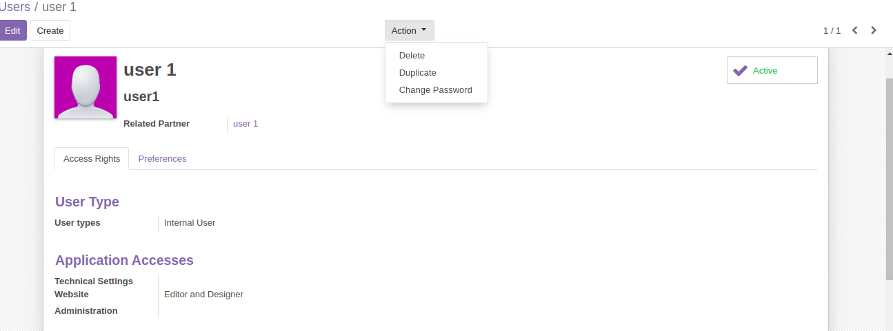

# Technical
- Odoo version 12. Addons Odoo RESTFUL API for access-token authentication
- Database: PostgresSQL 10.0

# Source Code and VCS
- Source code on github https://github.com/locnt1195/mobile_api
- VCS: I deploy this application on Digital Ocean.
- You can access application via 128.199.175.107:8071. username/password: admin/admin

# API Document
Get Access Token
```
headers = {
    'content-type': 'application/x-www-form-urlencoded',
    'charset':'utf-8'
}

data = {
    'login': 'admin',
    'password': 'admin',
    'db': 'demo_db'
}
base_url = <base url>

req = requests.get('{}/api/auth/token'.format(base_url), data=data, headers=headers)


content = json.loads(req.content.decode('utf-8'))

headers['access-token'] = content.get('access_token') 

```

Then add access-token to every request.

Get User balance:
```
- '/api/partner/balance', GET
- Result:
    {
        'success': 1,
        'data': {
            'balance': partner.balance}
    }
```

Make transactions:
```
- '/api/partner/sent', POST
- Data:
    {
        'parter_id': to other partner id,
        'amount': amount money, # more than 10,
        'description': text of description
    }
- Result:
    {
        'success': 0 or 1, success or failed
        'message': message text,
        'transaction_date': if success, return datetime of this transaction,
        'balance': balance left of partner
    }
```

Retrieve Partner Transactions:
```
- '/api/partner/transactions', GET
- Data:
    {
        'from_date': limit date from,
        'to_date': limit date to,
        'limit': numbers of transactions
    }
- Result:
    {
        'success': 0 or 1,
        'data': list data of transactions
    }
```

# Usage
Clone project from git link above.

Change the folder permission to make sure that the container is able to access the directory:
```
$ sudo chmod -R 777 project
$ sudo chmod -R 777 etc
```

Start the container:
```
$ docker-compose up
```

* Then open `localhost:8071` to access Odoo 12.0. If you want to start the server with a different port, change **8071** to another value:

# Running Application
1. When you open application, you will see apps management menu. CLick install module Mobile Wallet API.

2. Create User
- Goto Settings / Users  & Companies. Then Create new user.
- To change password. Click Action > Change Password

- Click on field Related Partner. Then click tab Transaction to see transactions information


